# Download and Installation Guide to Develop a SaaS Multitenant Business Application on SAP Cloud Platform in the Cloud Foundry Environment

## Prerequisites

* You understand the domain model (account structure) of SAP Cloud Platform; see [this blog](https://blogs.sap.com/2018/05/24/a-step-by-step-guide-to-the-unified-sap-cloud-platform-cockpit-experience/).

## Deploying the application to SAP Cloud Platform

In this document, we'll cover the steps that are needed to deploy a sample multitenant business application to your Cloud Foundry space in your SAP Cloud Platform account.

## Scenario

There is a SaaS application provider - Provider XYZ. Provider XYZ , henceforth referred to as XYZ, would like to build an application that displays a hello message. The hello message will display the logged in user's name and the tenant from
which the user has logged in as shown in the image.

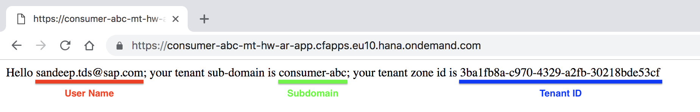

As XYZ, we will build a *Hello World* application `mt_hw_node_app` to display the 'hello message'. Also, since each tenant will access the application from a unique URL, we will build an app router app `mt_hw_ar_app` to resolve the URL, authorize the request and forward the request to our application - `mt_hw_node_app`.

## 1. Clone The Git Repository

1. Open SAP Web IDE and clone the project that is available [here](//TODO).

    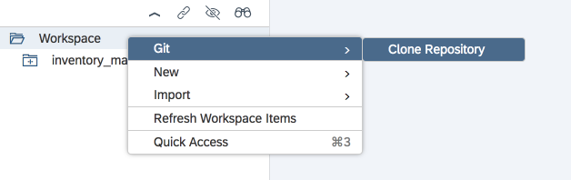


2. Your cloned project structure should look like this:

    

## 2. Understand The Project Structure

### 2.1. mt_hw_node_app - SaaS Provider Application

This project contains the code to display the 'Hello Message'
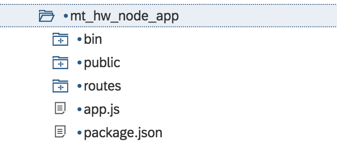

* **app.js** - Securing the access to the application
    * We secure our application using the xsuaa service.

* **index.js** - Defining the REST endpoints

    We define 3 REST endpoints in `index.js`.
    * `GET '/'` - Application Logic: This end point will show the 'Hello Message' and display the tenant specific information
    * `PUT '/callback/v1.0/tenants/*'` - When a consumer subscribes to a SaaS application, the SaaS provisioning service invokes this API.
    * `DELETE '/callback/v1.0/tenants/*'` -

### 2.2. mt_hw_ar_app - App Router Application
This project contains the code for the app router application.

* **package.json** - We add `@sap/approuter` as a dependency and specify `approuter.js` as the start file.

Please [click here](https://help.sap.com/viewer/65de2977205c403bbc107264b8eccf4b/Cloud/en-US/5310fc31caad4707be9126377e144627.html) for more information

## 3. Update the CF end-point
Before we make our initial deployment, you need to update the CF End point in the files mentioned in this section.

CF End point example
```
cfapps.eu10.hana.ondemand.com
```

1. **mta.yaml** - We update the CF End point to the tenant host pattern
   * Using the project explorer in SAP Web IDE, go to `mta.yaml` as shown in the picture
    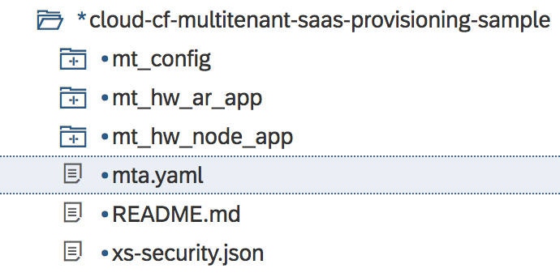
   * Locate **TENANT_HOST_PATTERN** and add your CF end-point.
    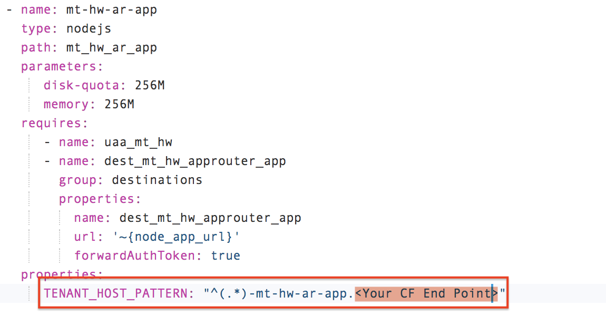

2. **index.js** - We update the CF End point for the call-back URL
   * Using the project explorer in SAP Web IDE, go to `index.js` as shown in the picture
    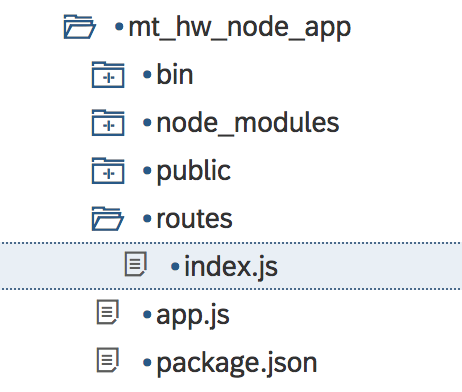
   * Search for **tenantAppURL** and add your CF end-point.
    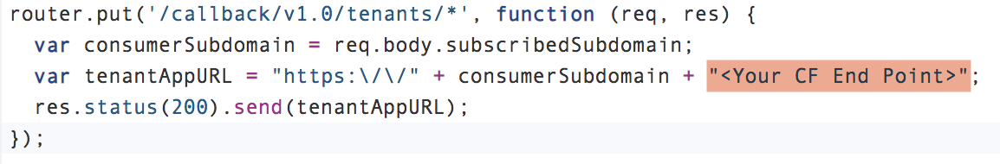

## 4. Deploying the application

1. Right-click on the project entry and choose Build → Build as shown in the image
    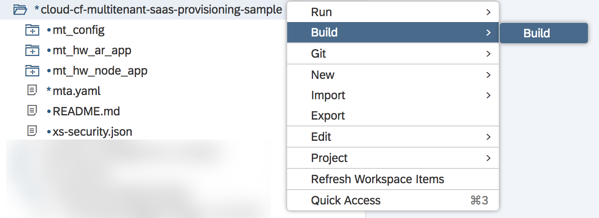

    On successful completion of the build, a `.mtar` file is created in a folder called **mta_archives**.
    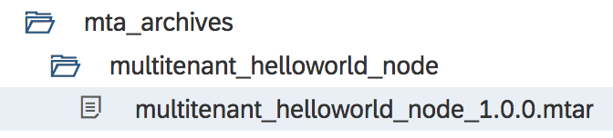


2. Now, right click on the newly created *.mtar* file and choose **Deploy** &rarr; **Deploy to SAP Cloud Platform**
    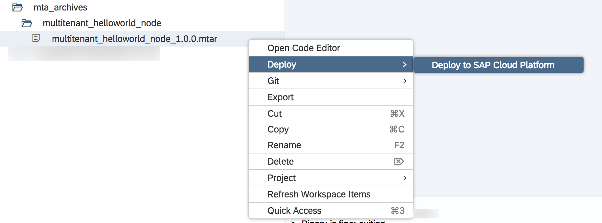

3. In the pop-up that appears, please enter the sub-account details where you wish to deploy the provider application.
    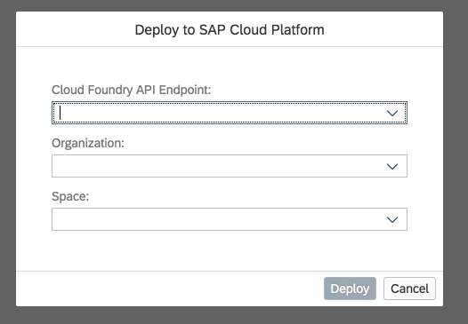

    On successful deployment of the app, open the app-router app. You should see a `hello message`.


## 5. Registering The Provider Application To SaaS Provisioning Service
In this section, we'll cover the steps that you need to do so that your application is registered and available in SAP Cloud Platform as a multitenant application. Your hosted application will then be visible to other **consumer sub-accounts** (tenants) for subscription.

### 5.1. Preparing config.json for SaaS Provisioning Service

1. Using the project explorer in SAP Web IDE, open `config.json` under *mt_config* folder as shown in the picture
    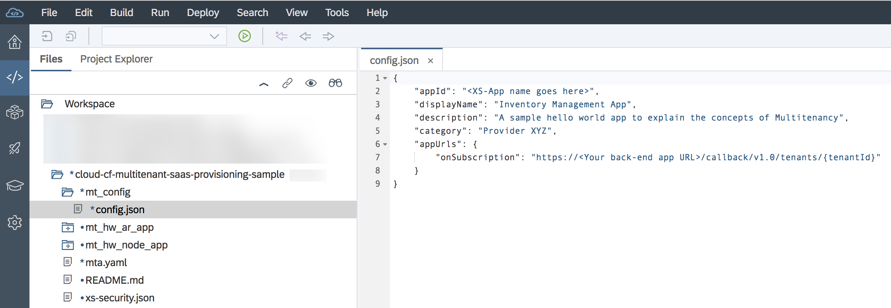

    We will now update the information in this file.

2. Using the cf CLI, connect to your space in your Cloud Foundry landscape.

3. To view the environment variables of your application, execute the following command in the CF CLI:

    ```
    cf env mt-hw-node-app
    ```

4. Copy the value of `VCAP_SERVICES.xsuaa.credentials.xsappname` to the **<`XS-App name goes here`>** placeholder in your *mtconfig/config.json* file.

    Example:
    ```json
    "appId": "multitenant_helloworld_node!t2160",
    ```

5. To view the application route of your application, execute the following command in your CF CLI:

    ```
    cf app mt-hw-node-app
    ```
6. Copy the value of `routes` to the **<`Your back-end app URL`>** placeholder in your *mtconfig/config.json* file.

    Example:
    ```json
    "appUrls": {
		"onSubscription": "https://mt-hw-node-app.cfapps.eu10.hana.ondemand.com/callback/v1.0/tenants/{tenantId}"
	}
    ```

7. Download the `config.js` file as shown in the image
    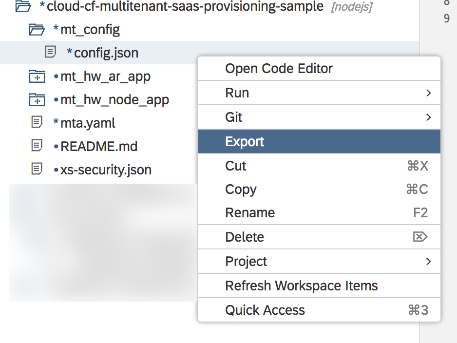

### 5.2. Create SaaS Provisioning Service Using CF CLI

1. Create a new service instance of SaaS registry by executing this command in your CF CLI terminal:
    ```
    cf cs saas-registry application <Give a name for your SaaS Provisioning Service> -c <Path to config.js file downloaded in the previous step>/config.json
    ```

    Example
    ```
    cf cs saas-registry application mt-hw-app-saas-registry -c mtconfig/config.json
    ```

2.  Bind the app to the SaaS registry service instance by executing this command:
    ```
    cf bs <SaaS Provider Application Name> <Name Of Your SaaS Provisioning Service>
    ```

    Example
    ```
    cf bs mt-hw-node-app mt-hw-app-saas-registry
    ```

3.  Re-stage the app by executing this command:
    ```
    cf restage <SaaS Provider Application Name>
    ```

    Example
    ```
    cf restage mt-hw-node-app
    ```

## 6. Subscribe To The Application
In this section we will cover the steps that a consumer must perform to subscribe to the application.

### 6.1. Subscription Through SAP Cloud Platform Cockpit

1. Sign in to the SAP Cloud Platform.

2. Navigate to the global account where you deployed the sample multitenant business application.

3. Create a Cloud Foundry sub-account for the application consumer (tenant). There's no need to create a Cloud Foundry org and space.

   Note: Ensure that this sub-account is within the same organization as the provider sub-account.

4. Navigate to the new consumer sub-account and open the **Subscriptions** tab. You should see the **Hello World** under **Provider ZZZ**.

    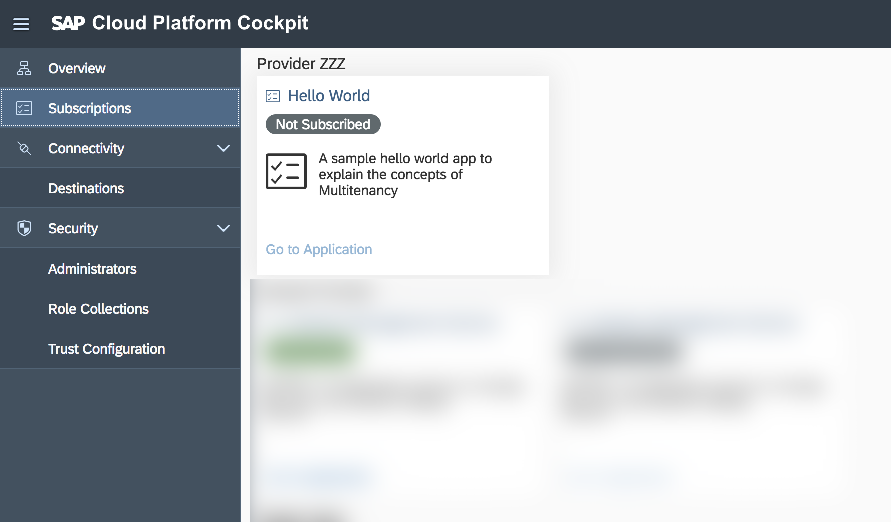


5.  Click on the **Hello World** tile and then on the **Subscribe** button.
    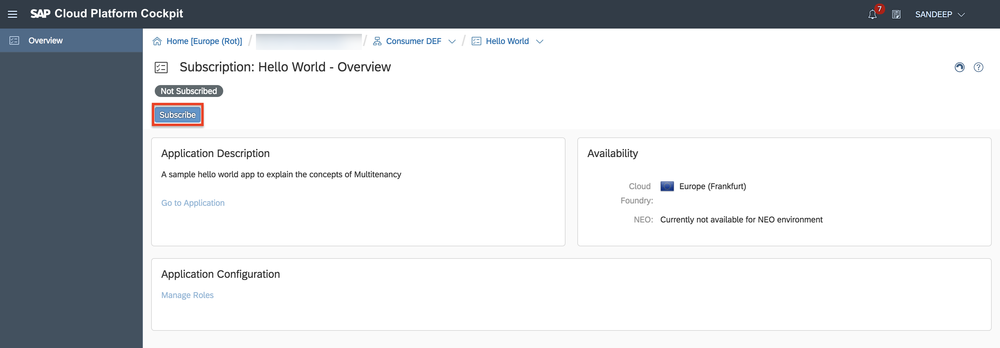


6.  Once the subscription process is completed, click on the **Go to Application** link to open the consumer app.
    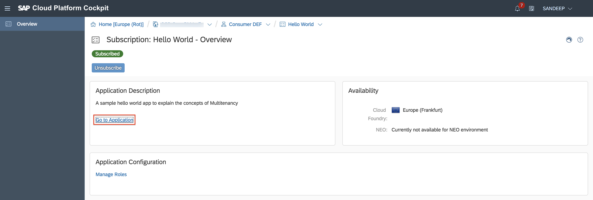

7. As a last step you need to create a route for your consumer. Please follow the steps highlighted in the [6.3 section of this documentation](#63-creating-a-route-manually).

### 6.2. Creating a Route Manually
For the current SaaS application, when you hit the URL you will not be able to access and see a page as shown in the image.

```
cf map-route mt-hw-ar-app cfapps.<landscape>.hana.ondemand.com --hostname xxxmtxsmsb0-mt-hw-ar-app
```

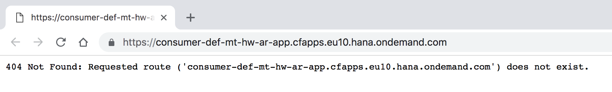

To create a route for the consumer please follow the steps mentioned in this section.

Note: In the coming series we will see how this step can be automated.

1. Go to SAP Cloud Platform Cockpit &rarr; Subaccount &rarr; Space and click on `Routes`.
        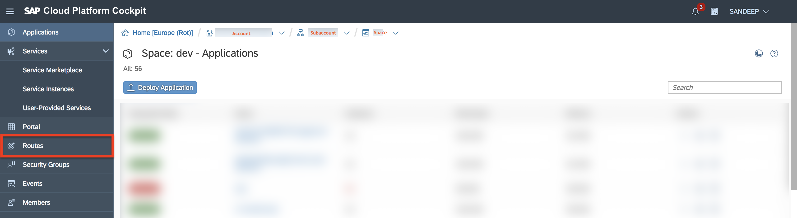

2. Click on `New Route`
        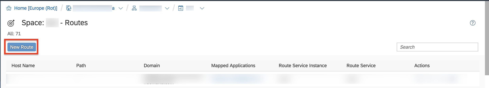

3. In the pop-up that appears enter the following details and click on `Save`.
    ```
    Domain: <Select the CF Domain of your tenant URL>
    Host Name: <Enter the tenant app-host name>
    Path: Empty
    ```
    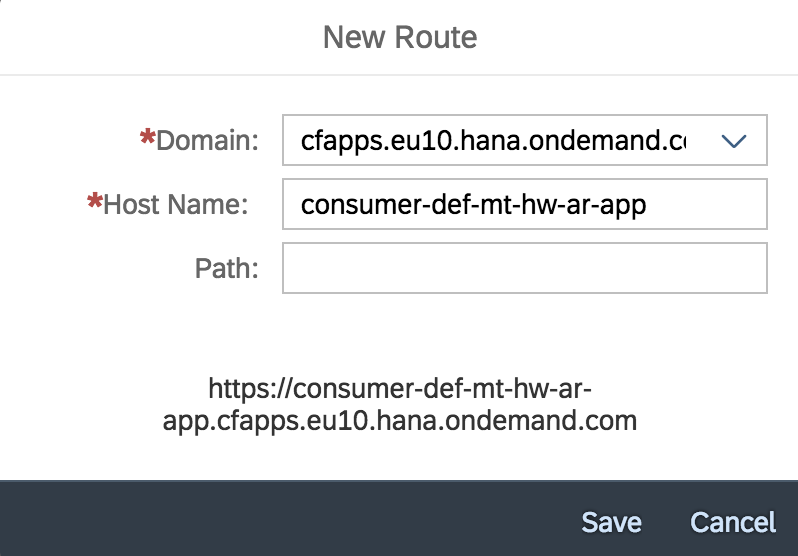

4. Now search for the new route that you've created and click on Map Route action as shown in the image.
        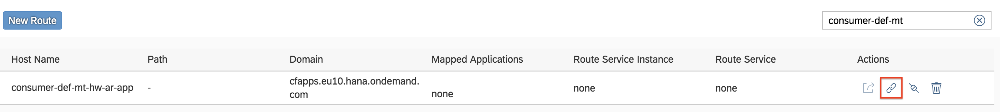

5. In the popup that appears, select `mt-hw-ar-app app` (App Router app) and click on `Save`
        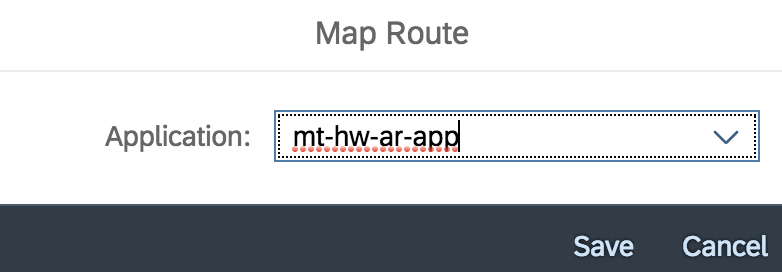

6. Now that you're route is mapped to your application, you can navigate to the app using the tenant URL by clicking on the Launch Route action as shown in the image.
        
